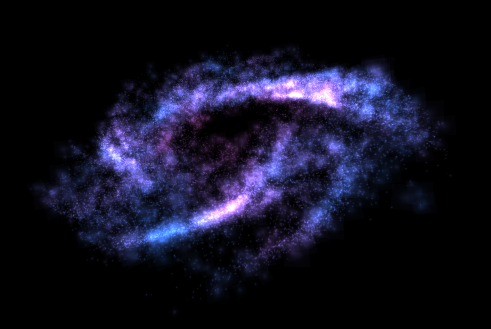
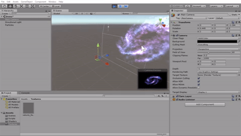

# UnityParticleGalaxyGPGPU

A particle system modeling galaxies. Runs on the GPU using compute shaders. Made with Unity.

Particles motion is computed by combining an orbital motion and 3D vector field. This vector field depends on [Keijiro's implementation of 3D Perlin Noise](https://github.com/keijiro/PerlinNoise).
